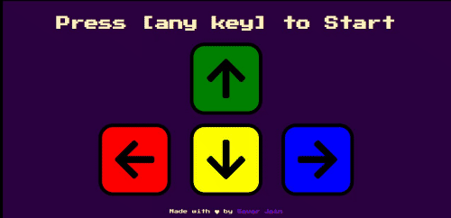

# Simon's Game

A clone of the popular Simon's Game in which you have to copy the pattern that is shown to you. In addition to clicking the correct square, users can use the arrow keys.

## Table of Contents

- [Deployment](#deployment)
- [Built With](#built-with)
- [Install](#install)
- [Author(s)](#authors)
- [License](#license)
- [Acknowledgement](#acknowledgement)

 

## Deployment

**[Live Demo: https://savarj.github.io/simons-game/](https://savarj.github.io/simons-game/)**

 

## Built With

- [HTML](https://developer.mozilla.org/en-US/docs/Web/HTML)
- [CSS](https://developer.mozilla.org/en-US/docs/Web/CSS)
- [Javascript](https://developer.mozilla.org/en-US/docs/Web/JavaScript)
- [jQuery](https://api.jquery.com/)

## Install

    $ git clone https://github.com/SavarJ/simons-game.git
    $ cd simons-game
    
### Running the project

    $ start index.html

## Author(s)

- **[Savar Jain](https://jainsavar.com)**

## License

Copyright (c) 2021 Savar Jain

Licensed under the [MIT License](LICENSE)

## Acknowledgement

- Challenge Project of The Complete 2021 Web Development Bootcamp by Dr. Angela Yu with some twists/changes
